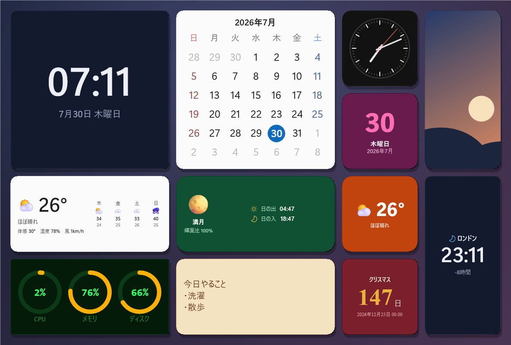
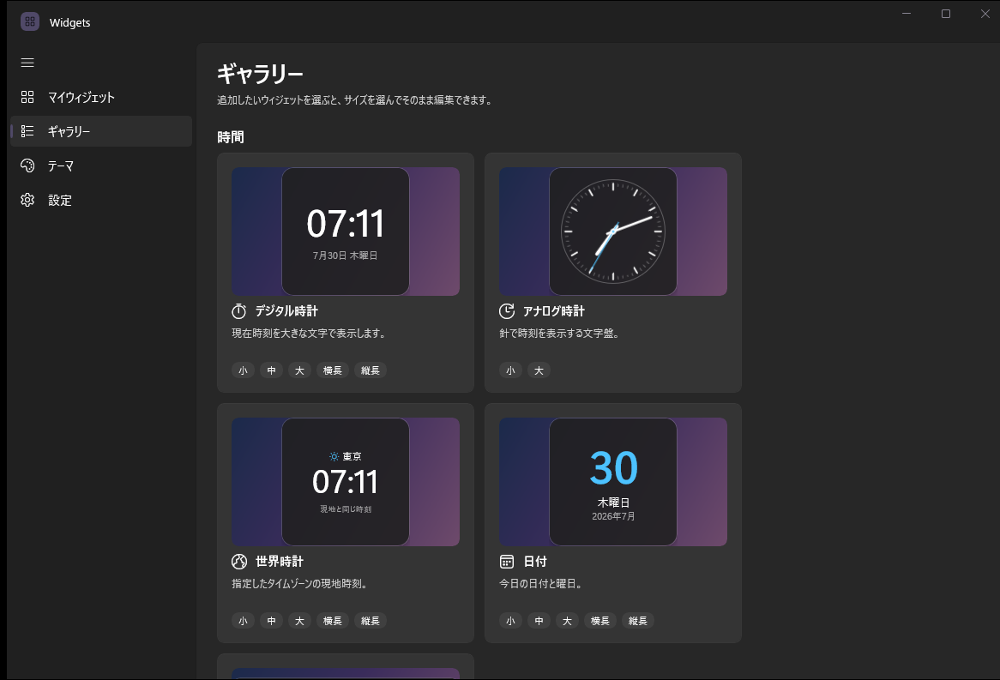
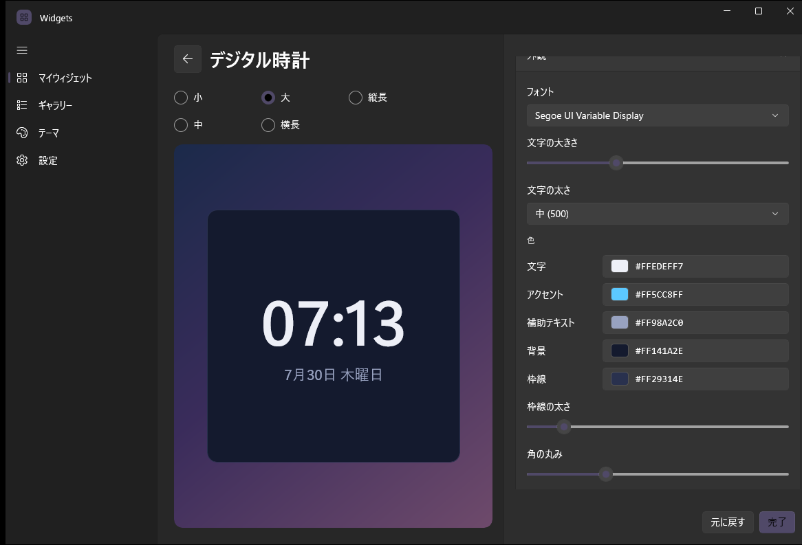
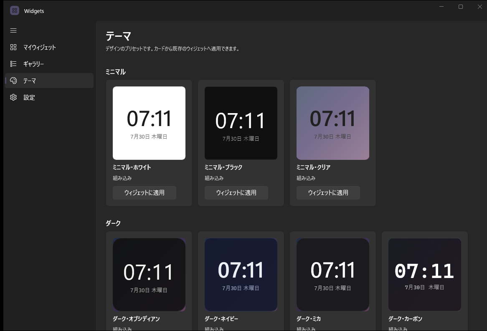
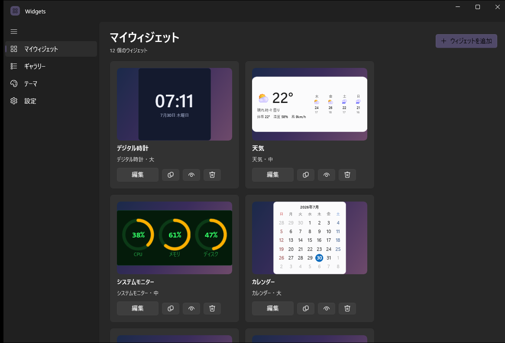

# Widgets

> **ベータ版 (v0.1.0-beta)** — 動作しますが、まだ検証が十分でない部分があります。

Windows 11 のデスクトップに、好きなウィジェットを自由に配置できるアプリケーションです。

WinUI 3 / Windows App SDK 1.8 / .NET 9 で実装されています。



---

## 特徴

### 12 種類のウィジェット

| カテゴリ | ウィジェット |
| --- | --- |
| 時間 | デジタル時計 / アナログ時計 / 世界時計 / 日付 / カレンダー |
| 情報 | 天気 / 天体（日の出・日の入り・月齢） / カウントダウン |
| システム | システムモニター（CPU・メモリ・ディスク・ネットワーク） / バッテリー |
| パーソナル | 写真（スライドショー対応） / メモ |

ギャラリーから種類とサイズを選ぶと、そのままエディターへ進みます。



### 5 つのサイズ

小 (176×176) / 中 (368×176) / 大 (368×368) / 横長 (560×176) / 縦長 (176×368)
さらに 0.5〜3.0 倍のスケール調整が可能です。

### 徹底したカスタマイズ

Widgetsmith と同じく、見た目のほぼすべてを変更できます。

- **フォント** — 書体・ウェイト・サイズ倍率
- **色** — 文字色 (Tint) / アクセント / 補助色 / 背景 / 枠線。アルファ付きのカラーピッカーと HEX 入力に対応し、よく使う色は 6 つまで保存できます
- **形** — 角丸・枠線の太さ・内側の余白・不透明度・ドロップシャドウ
- **背景** — 単色 / フロスト (アクリル) / Mica / 透明 / 写真
- **プリセット** — 16 種類の組み込みテーマ。自分の配色に名前を付けて保存することもできます

左のプレビューは編集中の見た目をそのまま映します。



組み込みテーマは「テーマ」から既存のウィジェットへまとめて適用できます。



### 時間帯ウィジェット

Widgetsmith の代表的な機能です。1 つのウィジェット枠に対して時間帯ごとに別の内容を割り当てられます。
例えば朝は天気、日中はカレンダー、夜は時計、といった切り替えが自動で行われます。

### 透過の仕組み

「透明」や「フロスト」の背景は、Windows のアクリル効果ではなく **デスクトップの実際の描画を取り込んで合成** しています。

ウィジェットはフォーカスを奪わないように非アクティブ化ウィンドウ (`WS_EX_NOACTIVATE`) として作られますが、
Windows はこの種のウィンドウに対してアクリルのぼかしを無効化し、単色で塗りつぶしてしまいます。
一方でウィジェットは常にすべてのウィンドウより下（壁紙のすぐ上）に置かれるため、**背後にあるのは必ずデスクトップだけ** です。
そこで壁紙側を取り込んでウィジェット内に描くことで、フォーカスを奪わないまま本当に透けて見える表示を実現しています。

デスクトップの取り込みには `PrintWindow` を使うため、Wallpaper Engine のように
別のアプリが壁紙を描画している環境でも、画面に実際に見えているものと一致します。
取り込みに失敗した場合は、壁紙ファイルと配置スタイル（並べて表示・画面に合わせるなど）から再構成する方式に自動で切り替わります。

アニメーション壁紙を使っている場合は、設定の「アニメーション壁紙に追従する」を有効にすると追従します（CPU 使用率は上がります）。

### デスクトップへの配置

- ドラッグで自由に移動、グリッドや画面端へのスナップに対応
- **重なり順** — デスクトップ（壁紙の上・ウィンドウの下に固定）/ 通常 / 最前面
- **クリックスルー** — 操作を下のウィンドウへそのまま透過
- **ロック** — 誤ってドラッグしてしまうのを防止
- 全画面アプリ（ゲームや動画）の実行中は自動的に隠す
- マルチモニター / 混在 DPI に対応

置いたウィジェットは「マイウィジェット」から編集・複製・非表示・削除できます。



---

## 動作環境

- Windows 10 バージョン 1809 (17763) 以降 / Windows 11
- x64 または ARM64

ランタイムの事前インストールは不要です（自己完結型ビルド）。

## ビルドと実行

Visual Studio は不要で、.NET 9 SDK だけでビルドできます。

```powershell
dotnet build "src\Widgets.App\Widgets.App.csproj" -c Release
dotnet run  --project "src\Widgets.App\Widgets.App.csproj" -c Release
```

配布用の自己完結型ビルドを作る場合:

```powershell
dotnet publish "src\Widgets.App\Widgets.App.csproj" -c Release -r win-x64 --self-contained true
```

## データの保存場所

設定とウィジェットの定義は次の場所に JSON で保存されます。手で編集することもできます。

```
%LOCALAPPDATA%\Widgets\widgets.json
```

不具合が起きた場合のログは `%LOCALAPPDATA%\Widgets\crash.log` に出力されます。

## プロジェクト構成

```
src/Widgets.App/
├── Models/       ウィジェット定義・テーマ・カタログ（永続化されるデータ構造）
├── Services/     保存、天気 (Open-Meteo)、システム情報、天体計算、スタートアップ登録
├── Interop/      Win32 / DWM 相互運用（重なり順・透明化・モニター情報）
├── Hosting/      デスクトップ上のウィジェットウィンドウとその管理
├── Controls/     WidgetSurface（枠・背景・テーマ適用の共通描画）
├── Widgets/      12 種類のウィジェット描画
├── Views/        管理ウィンドウ（マイウィジェット / ギャラリー / テーマ / エディター / 設定）
└── Themes/       共有スタイル
```

## 外部サービス

天気予報と地名検索に [Open-Meteo](https://open-meteo.com/) を利用しています。API キーは不要です。
位置情報を設定していない場合、天気ウィジェット以外はオフラインで動作します。
